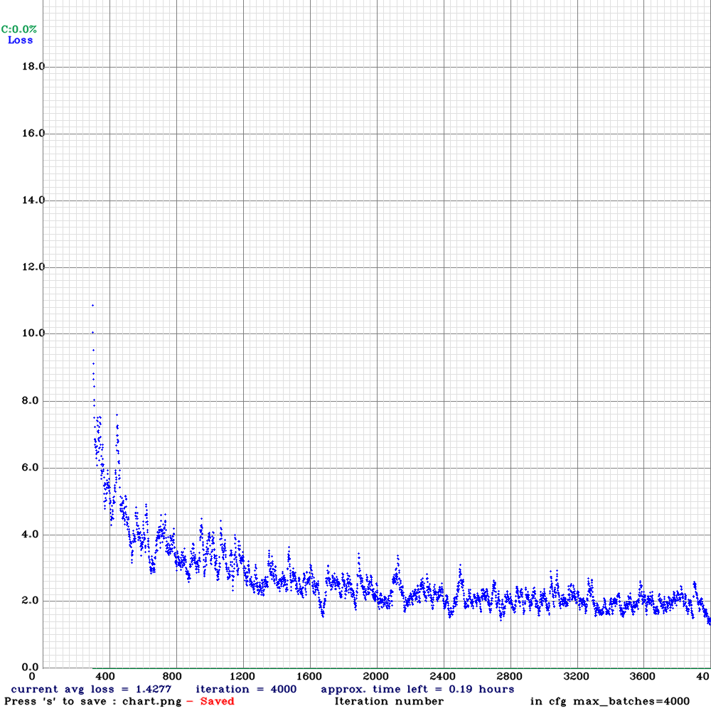
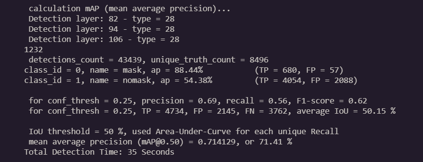

# Mask-Detection
Object Detection model trained using YOLOv3. It detects whether a person is wearing mask or not. Can be used to detect from both, image and video(webcam).

### Loss plot of model

### Performance (Mean Average Precision) 

### Sample Output for image

